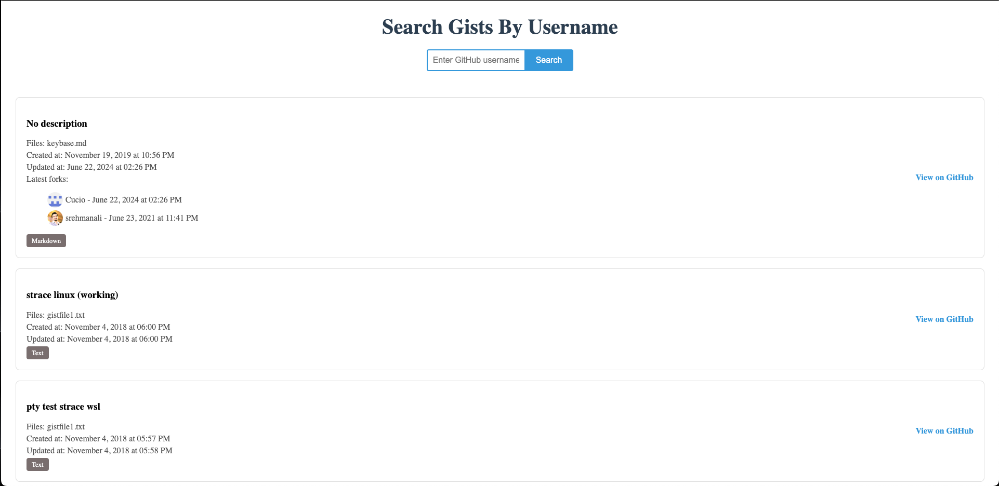
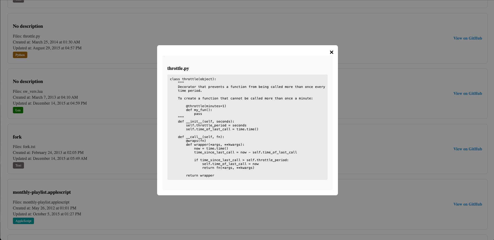

1.	Validation of Username Input
2.	Using Modal to display file content
3.	Use different colors for badges
4.	Ensured consistent and responsive design across different screen sizes
5.	Fixed Github API limit rate

Further Improvements
1.	Adding unit tests
2.	Enhance UI/UX
3.  Improve Error Messages
4.  Advanced Search Features (filter and sort gists by various criteria)